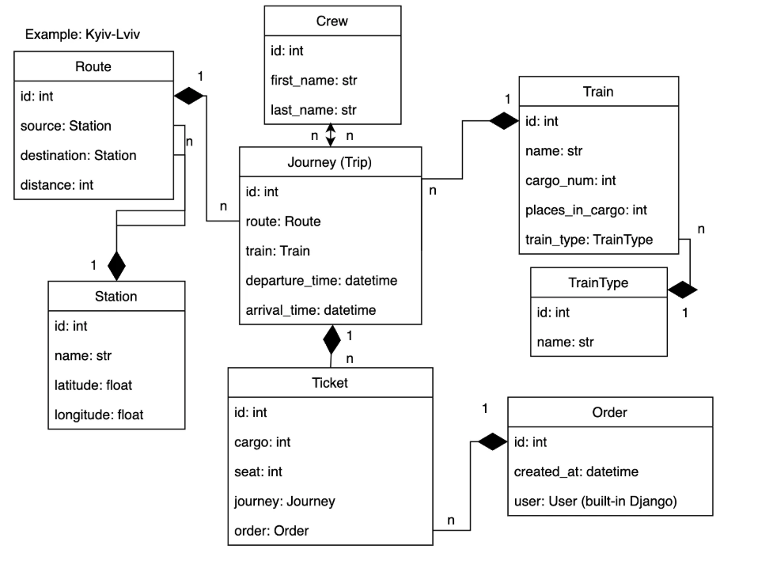

# Train Station Management API

This is a Django REST API for managing train stations, routes, trains, trips, and orders. The API provides functionality for users to view and manage stations, routes, train types, trips, tickets, and crew members. It supports features like filtering and pagination for better management of data.

## Features
- Manage stations, routes, trains, trip details, orders, and crews.
- Filters to search and sort stations, routes, and trips.
- Pagination for trip orders.
- Permission-based access control for different users.
---
## Database Structure

---
## Setup Instructions

### 1. Clone the repository
```bash
git clone https://github.com/KKvladys/api-service-train-station.git

# Set up the virtual environment
python -m venv venv
source venv/bin/activate  # For macOS/Linux
# venv\Scripts\activate   # For Windows

# Install dependencies
pip install -r requirements.txt

# Set up the database (make sure you have PostgreSQL running and configured)
# Update DATABASES section in train_station/settings.py with your database credentials
python manage.py migrate

# Create a superuser (optional)
python manage.py createsuperuser

# Run the server locally
python manage.py runserver
```

---
#### Running with Docker
Build and Start the Services
Use Docker Compose to build and run the application and database:
```bash
docker-compose up --build
```
***
The API will be available at http://127.0.0.1:8000/

API Endpoints:
train-station
---
### Crews
* GET /train-station/crews/
* POST /train-station/crews/
---
### Orders

* GET /train-station/orders/
* POST /train-station/orders/
* GET /train-station/orders/{id}/
* PUT /train-station/orders/{id}/
* PATCH /train-station/orders/{id}/
* DELETE /train-station/orders/{id}/
---
### Routes
* GET /train-station/routes/
* POST /train-station/routes/
* GET /train-station/routes/{id}/
* PUT /train-station/routes/{id}/
* PATCH /train-station/routes/{id}/
* DELETE /train-station/routes/{id}/
---
### Station
* GET /train-station/stations/
* POST /train-station/stations/
---
### Train types

* GET /train-station/train-types/
* POST /train-station/train-types/
---
### Trains

* GET /train-station/trains/
* POST /train-station/trains/
* GET /train-station/trains/{id}/
* PUT /train-station/trains/{id}/
* PATCH /train-station/trains/{id}/
* DELETE /train-station/trains/{id}/
---
### Trips

* GET /train-station/trips/
* POST /train-station/trips/
* GET /train-station/trips/{id}/
* PUT /train-station/trips/{id}/
* PATCH /train-station/trips/{id}/
* DELETE /train-station/trips/{id}/
---

## Environment Variables

This project uses environment variables for configuration. A template file `.env.sample` is provided to guide you in setting up these variables. Before running the project, create a `.env` file based on the template and provide the required values.

### Setting Up Environment Variables
1. Copy the `.env.sample` file to create your `.env` file:

   ```bash
   cp .env.sample .env
    ```